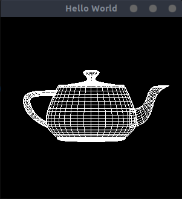
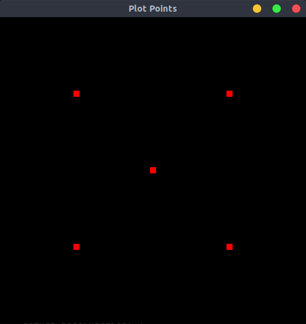
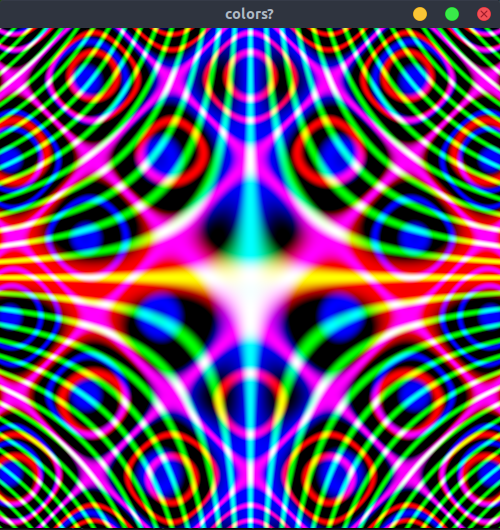

opengl-playground
---
messing around with pyopengl

| Project | Example |
| ------- | :------:|
| Teapot Example |  |
| Plotting Points |  |
| Plotting Functions |  |
| Plotting Parametric Equations |  |
| Plotting Polar Equations |  |
| Plotting With Color |  |
| Chaos Game |  |

references
---
Stan Blank, Python Programming In OpenGL: A Graphical Approach to Programming
