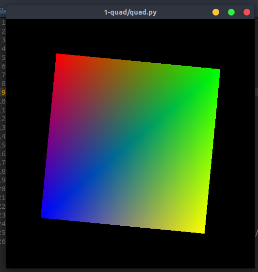
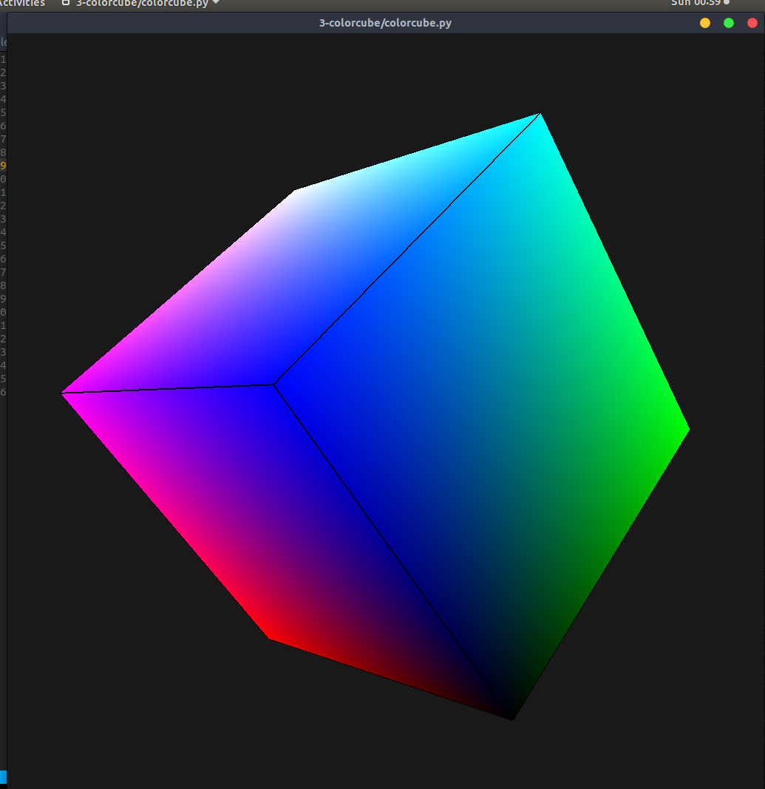
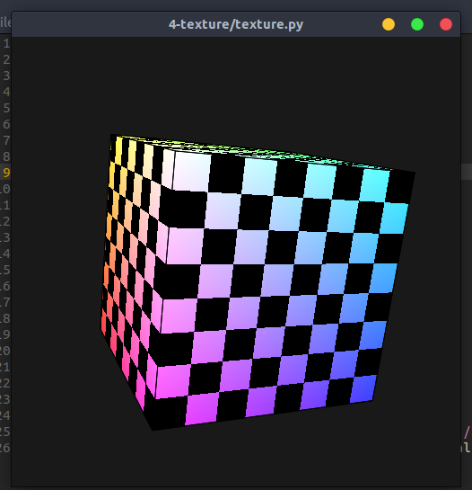
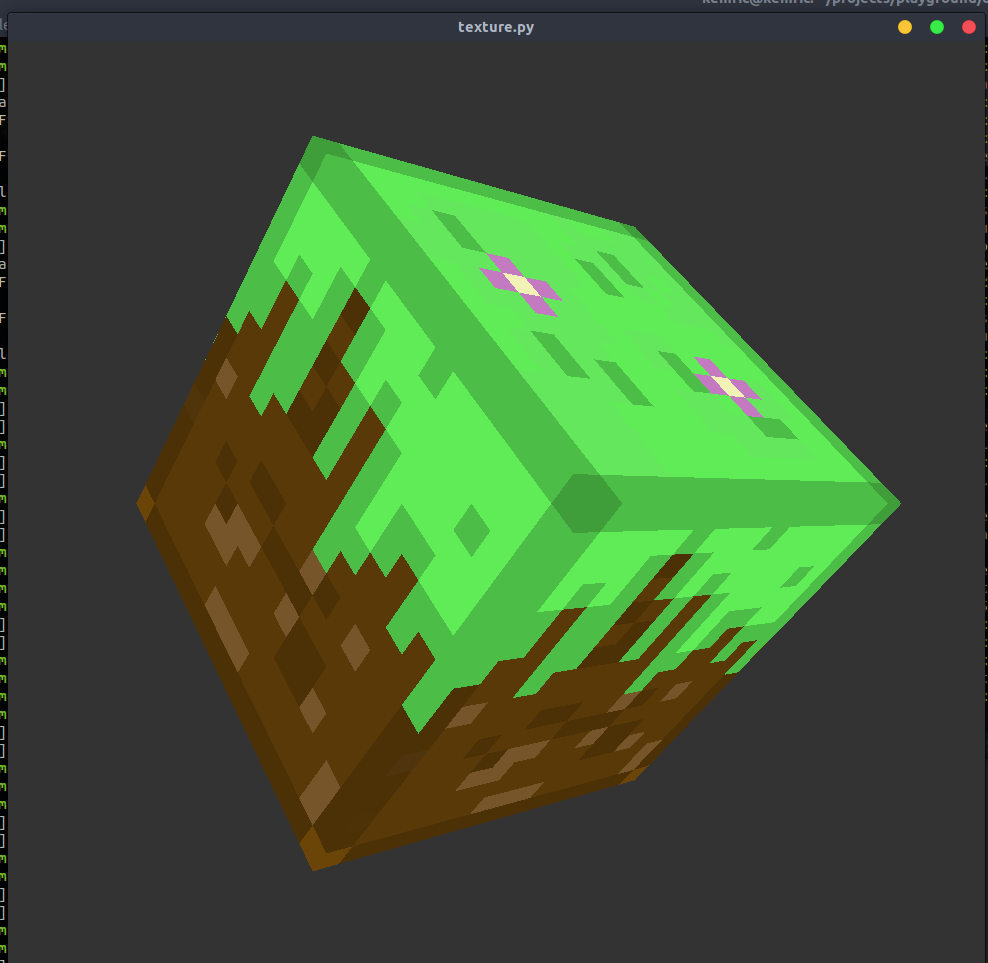
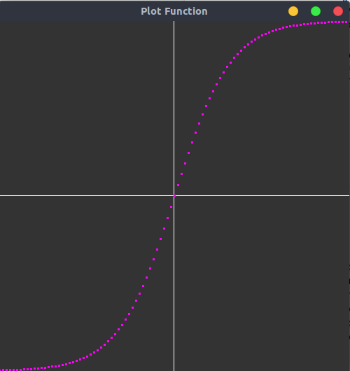
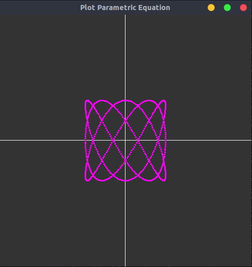
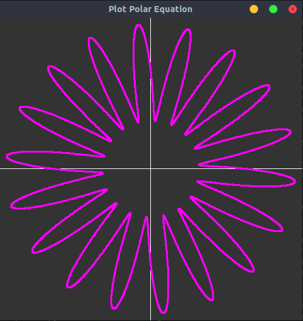
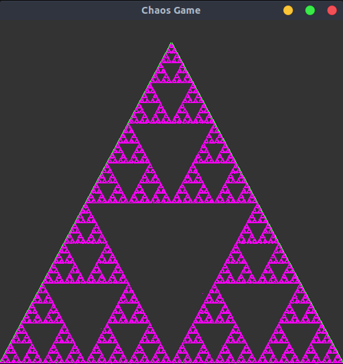

opengl-playground
---
messing around with pyopengl

[glumpy-playground](glumpy-playground)
---

  
  
  
  

[book exercises](opengl-book-examples)
---

  
  
  
  

references
---
 - [glumpy docs](https://glumpy.readthedocs.io)
 - [Texture Blending in GLSL](http://distrustsimplicity.net/articles/texture-blending-in-glsl/)
 - [Python & OpenGL for Scientific Visualization](http://www.labri.fr/perso/nrougier/python-opengl/)
 - Stan Blank, Python Programming In OpenGL: A Graphical Approach to Programming

